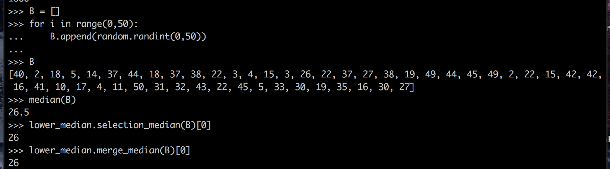
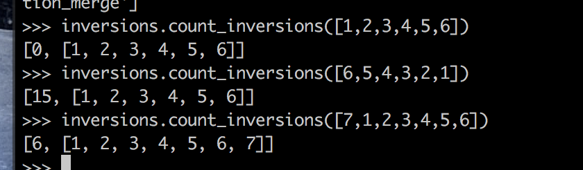
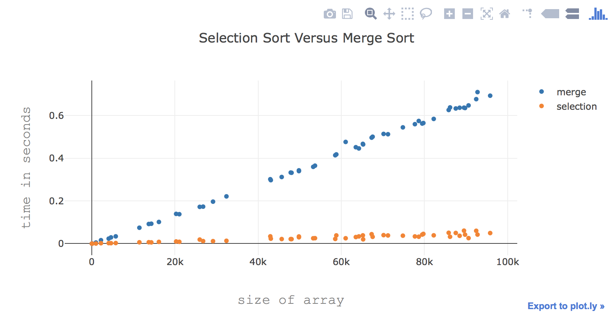
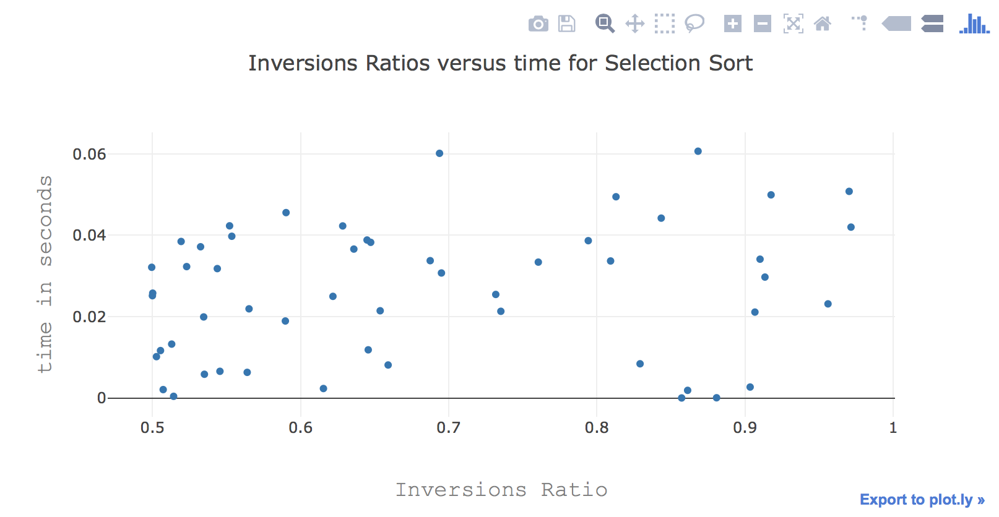
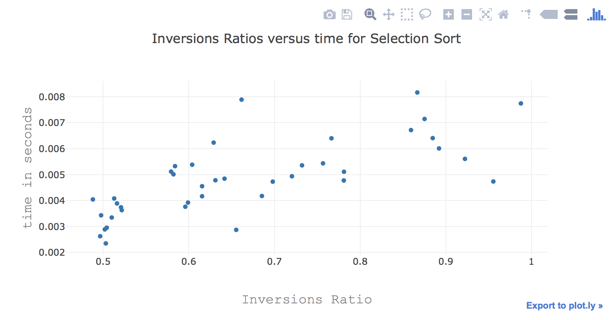
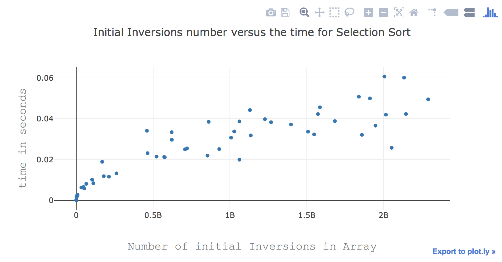
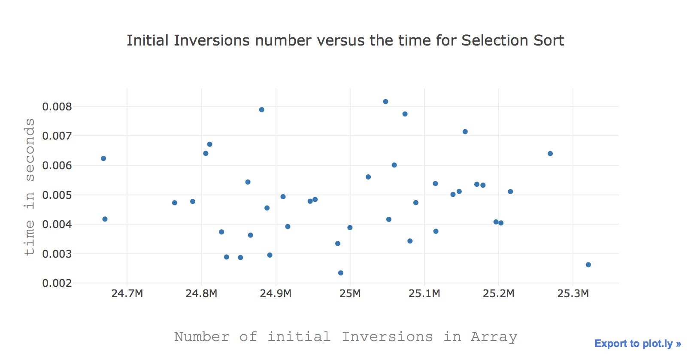
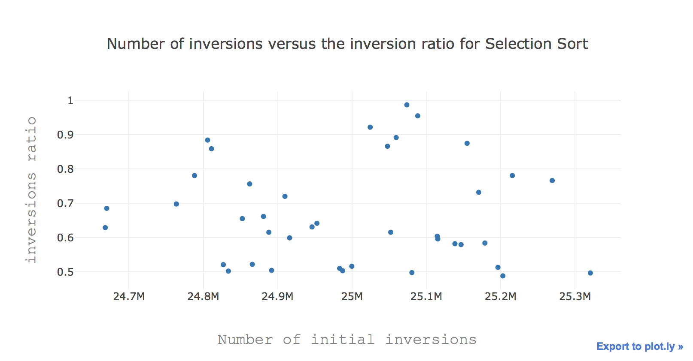

# William Burger - Mergesort versus Selection Sort Programming Project
## 1) Source Code - See attached documents
## 2) Smaller Test cases
* How I tested: I generated a bunch of randomized arrays and calculated the median using both my mergesort and selection implementations. I compared these results to using the Python numpy library median function to ensure that they are correct. Also, when I run on larger random data sets, I always check that the merge median and selection median values are equal. See a below example of a random array tested using numpy median and my merge versus selection medians:

* In the above image, since 26 is a value in the array and the value returned is 26.5, the lower median is 26 (it fell between the two values 26 and 27)
* I also tested inversions with a few test cases and counted by hand. Below is an example. This also helps show that merge sort is working correctly.

## 3) Runtime Results Graphs
* I graphed everything using Python's plotly package
* Below is the plot of runtimes between merge sort and selection for finding the median of random array sizes between 10 and 100000. 

* Below is the plot of Inversion ratios versus the time it takes for selection sort to determine the median of the array. This was done on arrays of different sizes in this case.

* Below is the plot of Inversion ratios versus the time it takes for selection sort to determine the median of the array. This was done with constant array size (Held at size 10000)

* I also wanted to look at how the initial number of inversions influenced the run time of selection sort. The first graph is with different tested array sizes while the second graph is with array size held constant at 10000.

* Another thing to look at was whether the number of initial inversions influenced how much sorting the program had to do. Below is the number of initial inversions versus the inversion ratio. Array size was held constant to account for this confounding variable.

### Discussion of Results 
* There is a lot of savings in time when using partition as compared to mergesort. From the graph of inversions ratio for selection sort, it is clear that selection sort frequently does not need to sort a majority of the array. Merge sort always sorts the entire array, so the inversion ratio would always be 0 and I decided not to graph those. While I looked for a pattern in the inversion ratio for Selection in finding the median and the resultant time, I do not see where a pattern would come from. There is a chance when selecting the pivot in the algorithm that the median will be selected, and then the algorithm will return the value very quickly. This will reduce the number of inversions in the array since everything less than the median will be moved to the left of the median and everything greater will move to the right. However, this won't necessarily decrease the inversions by a significant margin, even though it's possible that it could. For instance, image an array that is completely sorted except the median is flipped with the first element: the number of inversions after running the algorithm will be zero, and the inversion ratio will be 0. Next imagine that the array is arranged in perfect decending order, with the exception that the first element is the median: The inversion ratio will be approximately half by the end of running the algorithm, yet this run time would be similar to the 0 case since there was only one run of selection. If the array is completely sorted at the start, but the median is at the end of the array, then the run time would be very long as partition runs through the smaller values until it hits the median. The other graphs included were to show how the number of inversions didn't really influence the run time or the inversion ratio. 

## 4) Discussion of design decisions
* I used a modular approach for my programs. The goal was to compartmentalize functionality so that I could easily test and verify things worked properly. Also, I can now reuse my algorithm implementatios later if I want to
* I measured runtime in terms of seconds. This still shows the expected shape of the graphs since if a design is O(n) in terms of comparisons, then if each comparison takes a maximum of C where C is a constant amount of time, then in terms of runtime this would be O(Cn) which is still O(n) despite the measurement being in seconds instead of comparisons. 
* I used a python plotting library, plotly, so that I could easily generate random arrays in python and automatically create results.
* I chose to randomly create values in the arrays so that I had a nice random sample of potential values, and I wanted to go to a large enough number so that I could remove any sort of python constant overhead from the computational runtime

## 5) Conclusions
* There are many ways to find the median for an array. The most simple approach is to sort the array, and then look at the value in the 'middle' slot in the array. However, fully sorting the array isn't necessary and actually increases the expected run time. You can reduce the run time from O(nlogn) down to O(n) in the expected case. This is valuable in situations where arrays are large and random, because it is extremely likely that there are going to be savings in run time when its likely the median is selected as the pivot before the array is completely sorted. 
